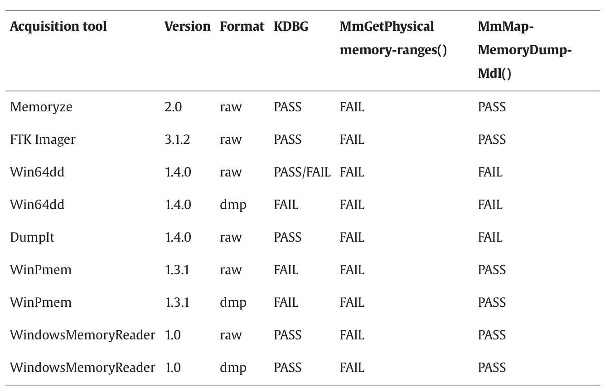

### Memory Acquisition Techniques. 
- Memory acquisition can be broken down into two categories, those that rely on OS software and those that rely on physical hardware *(Stüttgen & Cohen, 2013)*
- Some existing hardware can be repurposed to acquire memory such as Firewire *(Stüttgen & Cohen, 2013)*
- Tools like bodySnatcher can be used to subvert the Anti-forensics tools. However, there are drawbacks such as being platform dependent and requiring a temporary halt of the current OS. *(Stüttgen & Cohen, 2013)*
- You can avoid most pitfalls if you run code into the System Management Mode since it is independent of the OS and Hypervisor. However, it requires you to flash the BIOS and reboot the system making it useless in situations where you need the current contents of memory. *(Stüttgen & Cohen, 2013)*
- When running in protected mode the CPU doesn't directly access physical memory address but rather relies on virtual addresses. *(Stüttgen & Cohen, 2013)*

## Process Hiding in Linux
## Process Evasion in Windows
## Comparative Analysis of Techniques Across Operating Systems
- "A number of effective anti-forensic techniques against memory acquisition have been proposed. Substitution attacks, in which data fabricated by the attacker is substituted in place of valid data during the acquisition process have been implemented (Bilby, 2006, Milkovic, 2012). Alternatively a rootkit might disrupt the acquisition process altogether (e.g. hang the hardware) when detecting the presence of a forensic agent. This approach is especially effective against memory acquisition, since the volatility of the evidence does not permit the investigator to reacquire the memory under the same conditions." *(Stüttgen & Cohen, 2013)*
- 
# Challenges Faced by Forensics Analysts
## Detection Difficulties
## Stealth Mechanisms.
- "Bypassing memory acquisition tools that depend on the operating system was demonstrated by the ddefy tool (Bilby, 2006). This tool hooks the physical memory device and filters certain pages from being read through this interface, providing instead a cached copy (prior to kernel modification). In principle, any OS facility can be hooked in a similar manner in order to subvert the acquisition tool. Additionally, many acquisition tools have a user mode process to write and process the image. This increases the attack surface of the tool, by allowing standard user space hooks to modify the memory image as it is written to disk (Milkovic, 2012)." *(Stüttgen & Cohen, 2013)*
- Even hardware based tools can be subverted by using low-level manipulation of the memory controller's hardware registers. "By remapping some parts of the physical address space into an IO device, the CPU's view of this range is different from the hardware DMA view." *(Stüttgen & Cohen, 2013)*
- "An acquisition tool failing to acquire reserved regions which are not mapped to DMA devices potentially allows malware to hide code or data there." *(Stüttgen & Cohen, 2013)*
- "The BIOS memory map is subsequently refined during device configuration, and parts of the address space in the reserved regions finally contain device memory mapped IO. However, because of the way the BIOS set up the reserved regions, small segments in the reserved regions can still be backed by RAM. We call these segments “Hidden Memory”, as they can be used by rootkits to hide data from memory acquisition tools." *(Stüttgen & Cohen, 2013)*
## Encryption and Obfuscation.
- "It is impossible to issue the BIOS service interrupt Int 15 while running in protected mode once the operating system is booted. Therefore, when memory acquisition tools attempt to obtain the physical memory layout, they must rely on data structures or APIs within the operating system kernel, which are easily susceptible to manipulation." *(Stüttgen & Cohen, 2013)*
## Analysis Implications
- "Due to lack of research and understanding of anti-forensic techniques in memory acquisition, current commercial or free memory acquisition tools do not appear to implement mechanisms to protect their operations against anti-forensic attacks."*(Stüttgen & Cohen, 2013)*
- 
## Impact on Investigation Timelines.

## Limitations in Evidence Retrieval.
- Most memory acquisition tools during testing forget that they are likely to be used in a hostile environment not a lab environment. 
