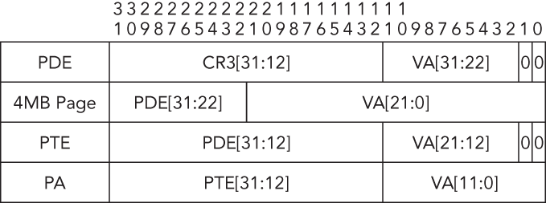

Commonly Used Tools
- Volatility
- IDA Pro / hex-rays
- Wireshark
- Sysinternals
- Microsoft WinDbg Debugger
- YARA

# Terms
- MMU: Memory Management Unit responsible for directing CPU to data stored in RAM and Cache
- TLB: Translation Lookaside Buffer responsible for 
- DMA: Direct Memory Access responsible for allowing PCI devices to access system memory independent of the CPU.

- In older machines I/O Devices were required to transfer data through the CPU in order to write to system memory. The DMA allows I/O devices to write to memory directly.
- **PCI devices with Bus Master Functionality and DMA support can access the system memory without using the CPU.** This is important since it prevents the untrusted software on the PC from being involved in the memory acquisition.

# Addresses
`0x31337`

In the context of memory addresses, the leftmost part often represents the higher-order bits, indicating a larger block or section of memory, while the rightmost part represents the lower-order bits, specifying the offset within that block.

For example:

The leftmost part "31" might refer to a particular segment or section of memory.

The rightmost part "337" would then represent the offset within that segment.

- A page fault is an exception that occurs when a program accesses a page in virtual memory that is not currently in physical memory (RAM).

## Linear vs Physical Address
- A linear address, also known as a "virtual address," is an address generated by the CPU during program execution. It represents the location in the virtual memory space.
-  A physical address refers to the actual location in the physical memory hardware (RAM). It represents the position of data in the physical memory modules.

# IA-32 x86 (32bit) Architecture 
- The x86 defines a small amount of extremely fast memory as **registers**. Registers are smaller, but faster than cache and serve to hold data such as loop counters or flags. 
- Each core contains eight 32-bit general purpose registers for preforming logical and arithmetic operations.
- The **EIP Register** or, program counter, contains the linear address of the next instruction that executes.
- There are five control registers that specify the processors configuration. 
    - CR0 contains flags that control the operating mode of the processor. **The flag that enables paging is stored here**.
    - CR1 is reserved and should not be accessed.
    - CR2 contains the linear address that caused a page fault
    - CR3 contains the physical address of the initial structure used for address translation. It is updated during context switches when a new task is started.
    - CR4 is used to enable architectural extensions such as PAE.
- Segmentation (segments) is a contiguous block of memory with a starting address and a length. Segments can represent different types of data or code sections.
- Each core contains two special registers which point toward segment description tables. These two tables are Global Descriptor Table (GDT) and Local Descriptor Table (LDT).
- There are also the following segmentation registers:
    - CS: Code Segment
    - SS: Stack Segment
    - DS: Data Segment
    - ES: Extra Segment
    - GS: General-Purpose Segment

## Paging 
- Paging provides the ability to virtualize the linear address space.
-  Each 32-bit linear address space is broken up into fixed-length sections, called pages, which can be mapped into physical memory in an arbitrary order.
- When a program attempts to access a linear address, this mapping uses memory-resident page directories and page tables to translate the linear address into a physical address.
- When a program attempts to access a linear address, this mapping uses memory-resident page directories and page tables to translate the linear address into a physical address.
- In the typical scenario of a 4KB page, as shown in Figure 1-2, the 32-bit virtual address is broken into three sections, each of which is used as an index in the paging structure hierarchy or the associated physical page.

- The IA-32 architecture also supports pages of size 4MB, whose translation requires only a page directory. 

- To compute the page directory entry (PDE) address, you combine bits 31:12 from the CR3 register with bits 31:22 from the virtual address.
- You then locate the page table entry (PTE) by combining bits 31:12 from the PDE with bits 21:12 of the virtual address.
- Finally, you can obtain the physical address (PA) by combining bits 31:12 of the PTE with bits 11:0 of the virtual address.

### Convert Virtual to Physical Address
- The page directory base (CR3) for PID 1024 is 0x7401000
- The virtual address is `0x10016270`
- Your first step is to convert the virtual address, 0x10016270, from hexadecimal to binary format because you will be working with ranges of address bits:
    - `0001 0000 0000 0001 0110 0010 0111 0000`
- Next, you decompose the address into the relevant offsets that are used during the translation process. This data is shown in
    - Paging Structure	    VA Bits	    Binary	        Hex
    - Page directory index	Bits 31:22	0001000000	    0x40
    - Page table index	    Bits 21:12	0000010110	    0x16
    - Address offset	    Bits 11:0	001001110000	0x270
- You can calculate the physical address of the PDE by multiplying the page directory index by the size of the entry (4 bytes) and then adding the page directory base, `0x7401000`.
    - PDE address = 0x40 * 4 + 0x7401000 = 0x7401100
- Next, you must read the value from physical memory stored at the PDE address. Make sure to account for the fact that the value is stored in a little endian format.
- Bits 21:12 of the virtual address provide the page table index because the page table is composed of 1024 (210) entries. You can calculate the physical address of the PTE by multiplying the size of the entry (4 bytes) by the page table index and then adding that value to the page table base
- PTE address = 0x16 * 4 + 0x17bf9000 = 0x17bf9058
- Bits 31:12 of the physical address are from the PTE and bits 11:0 are from the virtual address. Thus, the final converted physical address is this:
    - Physical address = 0x170b6000 + 0x270 = 0x170b6270

- It is also important to highlight a couple of the bit flags stored in paging structure entries that directly affect translation for all three paging modes discussed in the book. The address translation process will terminate if a paging structure entry has bit 0 (the present flag) set to 0, which signifies “not present.” Thus, it generates a page fault exception. If you are processing an intermediary paging structure, meaning more than 12 bits remain in the linear address, bit 7 of the current paging structure entry is used as the page size (PS) flag. When the bit is set, it designates that the remaining bits map to a page of memory as opposed to another paging structure.

- The IA-32 architecture’s paging mechanism also supports PAE. This extension allows the processor to support physical address spaces greater than 4GB.
-  On systems with PAE enabled, the linear address is divided into four indexes:
    - Page directory pointer table (PDPT)
    - Page directory (PD)
    - Page table (PT)
    - Page offset

# Intel 64 Architecture 
- Although the architecture can support up to 2^64 linear address or 16EB at this time it only supports 2^48 or 256TB since that is all that is required at this time.
- The extra space between bits 63:48 is filled with either all ones or all zeros. This is determined by the 47th bit. (this is also known as sign-extension).
- Intel 64 architecture supports an additional level of paging structures called page map level 4 (PML4).
- All entries in the hierarchy of paging structures are 64 bits, and they can map virtual addresses to pages of size 4KB, 2MB, or 1GB.
- Each of the paging structures is composed of 512 entries (29) and is indexed by the values extracted from the following ranges taken from the 48-bit virtual address:
    Bits 47:39 (PML4E offset)
    Bits 38-30 (PDPTE offset)
    Bits 29:21 (PDE offset)
    Bits 20:12 (PTE offset)

# Interrupt Descriptor Table
- A mechanism for interrupting process execution and passing control to a privileged mode software routine.
- Each processor has its own IDT composed of 256 8-byte or 16-byte entries, in which the first 32 entries are reserved for processor-defined exceptions and interrupts.
- Given the critical role that the IDT performs for operating systems, it has been a frequent target of malicious software. Malicious software might try to redirect entries, modify handler code, add new entries, or even create entirely new interrupt tables. For example, Shadow Walker (https://www.blackhat.com/presentations/bh-jp-05/bh-jp-05-sparks-butler.pdf) hooked the page fault handler by modifying the IDT and was able to return “fake” pages to the caller.

# Privilege Separation
- To prevent malware from accessing the critical components most modern operating systems implement some form of user and kernel mode privilege isolation.
- IA-32 architecture separates privileges into four rings with ring 0 being the most privileged and ring 3 being the lease privileged. 
- Kernel mode is implemented in ring 0. When the OS is operating in kernel mode is has unrestricted access to the underlying hardware.
- It can be important to know what level of access malware has obtained to know the possible affects it could have on the computer.

# System Calls
- Rather than have applications make system calls themselves, most OS define a set of stable API calls that can be used to preform system actions.
- 