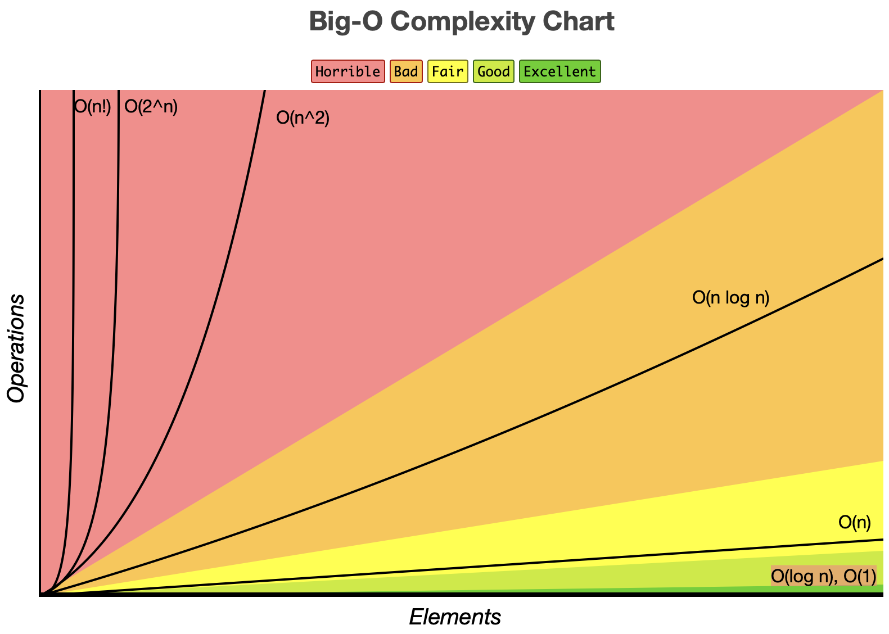

# Data Structures in JS

- A data structure is a way to store and organize data so that it can be used efficientlv
- A data structure is a collection of data values, the relationships among them, and the functions or operations that can be applied to that data
- Common data structure we use
    - DOM: The document object model in JS is a tree data structure
    - Undo/Redo: Stack data structure
    - OS Job scheduling follow a queue data structure

## Array in JS

- Characteristics
    - A data structure that can hold a collection of values
    - In JS arrays can hold a mix of data types
    - In JS arrays are resizable
    - Array are indexed beginning with 0
    - Array are iterable.

## Objects in JS

- Characteristics
    - Unordered collection of key/value pairs
    - Key must be string or symbol value type
    - Value can be any data type
    - Value can be retrieved using . or {} notation
    - Not iterable.

## Set in JS

- Characteristics
    - Holds a collection of values
    - Values must be unique
    - In JS sets are dynamically sized
    - Sets don't maintain insertion order.
    - Sets are iterable.
- Differences from array 
    - Arrays can contains duplicate values
    - Arrays maintain insertion order.
    - Searching and deleting elements is faster in sets

## Map in JS

- Characteristics
    - Ordered collection of key/value pair
    - Retrieve value using key
    - Are iterable
- Difference from objects
    - Objects are unordered
    - Object are not iterable 
    - Keys in objects can only be of string/symbol
    - A map doesn't contain default keys
    - Number of values must be calculated in an object while it's readily available in a map
    - Maps are restricted to just storing data

## Stacks

- Last in First out (LIFO)

## Linked List

- Contains a series of connected nodes.
- Order is not given by physical placement in memory, but rather by the previous node pointer.
- Can easily insert/remove elements without reorganization of entire structure
- Access an element is linear O(n)
- Prepending is O(1) append is O(n). While it possible to get O(1) with append it sacrifices memory.
- Linked lists come in two variants, singly or doubly
    - Singly LL contain nodes which have a value field as well as a pointer to the next node.
    - Doubly LL contain nodes have a value, next and previous field. It makes handling insertion easier, but at the expense of memory. 

## Hash Table

- Stores key/value pairs
- JavaScript's Object is a special implementation of the hash table data structure. However, Object class adds its own keys. Keys that you input may conflict and overwrite the inherited default properties
- Maps are what you should use in JS.
- A hashing function accepts the string key, converts it into a hash code using a defined logic and then maps it into a numeric index that is within the bounds of the array
- Functions
    - Set
    - Get
    - Remove
- Hash tables are typically implemented where constant time lookup and insertion are required
- Worst time complexity is O(n), average time complexity is O(1)

## Trees

- A tree is a hierarchical data structure that consists of nodes connected by edges
- A tree is a non-linear data structure, compared to arrays, linked lists, stacks and queues which are linear data structures.
- In linear data structures, the time required to search is proportional to the size of the data set. Trees however, owing to the nonlinear nature allow quicker and easier access to the data
- Trees won't contain loops or cycles
- Terms
    - Parent Node
    - Child Node
    - Leafs: Nodes without children
    - Siblings

### Binary Search Tree

- Have a maximum of two child nodes
- The value of each left node is smaller than the parent node
- The value of each right node is greater than the parent node
- Functions
    - Insert
    - Search
    - Depth for search (DFS) & Breadth for search(BFS)
    - Deletion
- 

## Graphs

- Categorized as either directed or undirected.
- A graph in which the edges have direction is called a directed graph
- A graph in which the edges are bidirectional are called unidirectional graphs.
- Examples
    - Google maps
    - Facebook, instagram and LinkedIn
    - 

# Algorithms

- A set of well defined instructions to solve a particular problem.
- Example: Following a recipe
- Characteristics:
    - Well defined inputs and outputs 
    - Each step should be clear and unambiguous. 
    - Should be language independent.
- Learning algorithms translates to learning techniques to solve problems
- Every algorithms comes with its own tradeoffs
-

## Time and Space complexity

- The absolute running time of an algorithm cannot be predicted since it depends on a number of factors, including:
    - Programming language used.
    - The computer it runs on.
    - Other programs running at the same time. (Background tasks)
    - Quality of OS
- We evaluate an algorithm based on its input size.
    - By evaluating against the input size, the analysis is not only machine independent but the comparison is also more appropriate. 
    - Time complexity - Amount of time taken by an algorithm to run, as a function of input size 
    - Space complexity - Amount of memory taken by an algorithm to run, as a function of input size
- We represent space time complexity using asymptotic notations
- Asymptotic notations are mathematical equations used to represent space time complexity
- Types of Asymptotic notations
    - Big O Notation (O-Notation) - Worst Case Scenario Complexity
    - Omega Notation (Ω-Notation) - Bast Case Scenario Complexity
    - Theta Notation (θ-Notation) - Average Scenario Complexity

### Big O Notation 

- Describes the complexity of an algorithm using algebraic terms.

- Time Complexity
    - O(N) - Linear
        - If there is a  loop its likely this
    - O(1) - Constant
        - Time doesn't change depending on input size
    - O(n^2) - Quadratic
        - Nested loop
    - O(n^3) - Cubic
        - Three Nested loops
    - O(log n) - Logarithmic
        - Input size reduce by half
    - O(1 + b)
        - If the algorithms is "do this, then do that" add the variables.
    ```c#
    for(let i = 0; i < a; i++){
        print(a)
    }
    for(let i = 0; i < b; i++){
        print(b)
    }
    ```
    - O(a*b) or O(ab)
        - If your algorithm is "do this for each time you do that" multiply the variable
    ```c#
    for(let i = 0; i < b; i++){
        for(let i = 0; i < b; i++){
        print($"{a} {b}")
    }
    }
    ```
- Space Complexity
    - O(1) - Constant
        - Memory size doesn't change depending on input size
    - O(n) - Linear
        - Memory grows when increasing input (n) size
        - E.g. Creating a duplicate array
    - O(logn) - Logarithmic
        - Memory needs grows, but not by the input size


## Recursion

- Recursion is a problem solving technique where the solution depends on solutions to smaller instances of the same problem
- In simpler terms, it's when a function calls itself.
- Figure out how to break down the problem into smaller versions of the same problem
- Identify the base case for recursion (The if statement)

## Math

- 

## Sort

- The four sorting algorithms are:
    - Bubble sort
        - Inefficient
        - Highest number 'bubbles' to the top.
    - Insertion sort
    - Quick sort
    - Merge sort

## Search

### Linear Search

### Binary Search

- Only works on a sorted array

## Window Sliding Technique

- 

## Misc
